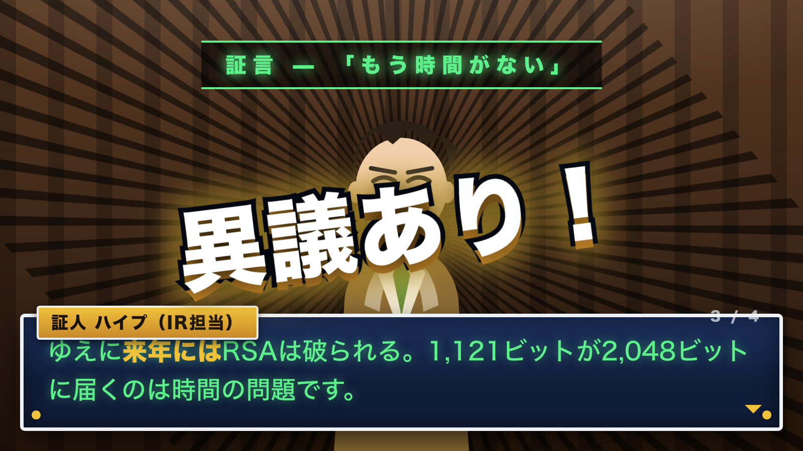
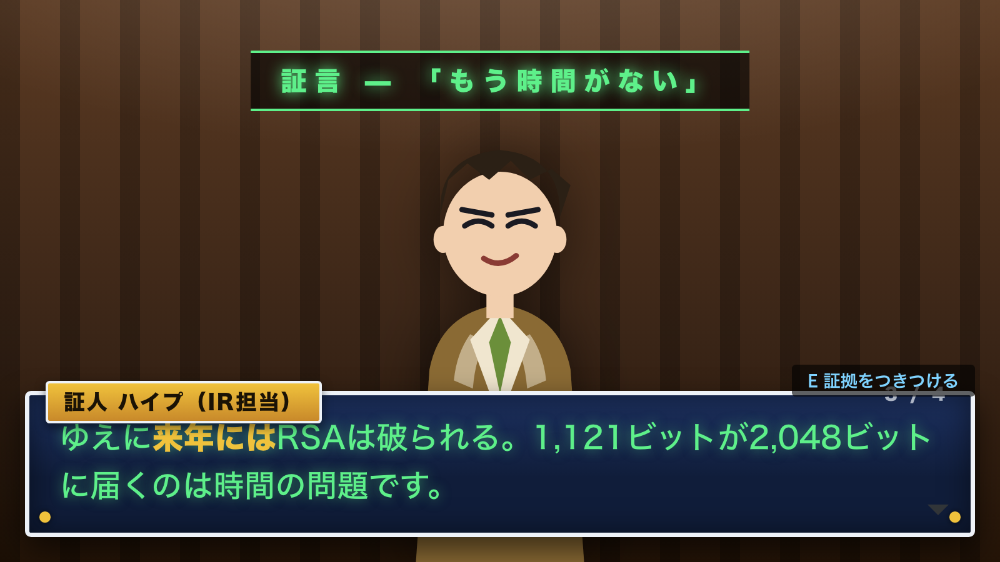
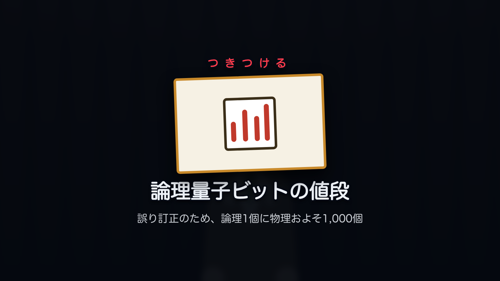

# GAMEIF PRESENTATION

**プレゼンを、法廷バトルとしてやる。**

通説をキャラに証言させ、聴衆が根拠を選んでムジュンを突く。
学びの核を「異議あり！」の瞬間に置くための、法廷型プレゼンのテンプレートエンジンです。
ケースは **JSON 1枚**。ビルドすると **HTML 1枚**になって、どこでも動きます。



---

## なぜ法廷なのか

逆転裁判の機構は、そのまま**学習の機構**に写せます。

| 原作の機構 | プレゼンでの役割 |
|---|---|
| 証言 | 聴衆がいま持っている**通説・誤解**をキャラに言わせる |
| ムジュン | 誤解が事実と衝突する点 = **学びの核** |
| 証拠品 | データ・図・引用 = 根拠スライド |
| つきつける | 聴衆が「どの根拠で殴るか」を選ぶ = **参加** |
| ゆさぶる | 深掘り・補足の置き場 |
| 異議あり！ | 山場。ここに最重要メッセージを置く |
| 休廷 | 通常スライドに戻る = 講義パート |
| 判決 | 持ち帰りの回収 |

スライドは「聞く」。法廷は「**自分が弁護人として殴る**」。
同じ内容でも、聴衆が誤解を自分の手で壊したほうが残ります。

目指しているのは特定の作品の体験ではなく、**ゲームをしているようなプレゼン**です。
法廷はその第一形式で、場面と役割は差し替えられる作りにしてあります。

### 画角が変わる

機構の次に効くのがカメラです。**重要な指摘のとき、検討のときに、見ている角度が変わる。**
立ち位置が左右で入れ替われば切り返しが入り、ムジュンを突けば指差しの煽りに寄り、
裁定の瞬間は引いて俯瞰になる。既定では `pose` から自動で決まり、決めの1行だけ
`"shot":"point"` のように明示します。→ [FORMAT.md のカメラの節](docs/FORMAT.md)

| 証言（通説を喋らせる） | つきつける（ストーリー形式では自動） |
|---|---|
|  |  |

立ち絵は差し替え前提のプレースホルダです。
[docs/ILLUSTRATION-PROMPTS.md](docs/ILLUSTRATION-PROMPTS.md) のプロンプトで生成して
`assets/` に置くと入れ替わります。

---

## 使ってみる

```bash
git clone https://github.com/kou-uni/gameifpresentation.git
cd gameifpresentation
npm start           # → http://localhost:8787
```

デモケース（**第1審 — 量子コンピュータは、来年RSAを破るのか**）が入っています。
`→` で進み、`Esc` で目次。

### 進行形式は2つ。同じケースを両方で回せます

| | **ストーリー形式**（既定） | **クイズ形式** |
|---|---|---|
| 進め方 | **`→` だけ。** つきつけは自動で決まる | 聴衆が `E` から証拠を選ぶ |
| ライフ | 出ない | お手つきで減る |
| 向く場面 | **発表・講演** | 研修・ワークショップ |

既定をストーリーにしているのは**本番のテンポのため**です。30人の前で正解の証拠を
探させると、そこで場が止まります。一方、研修なら自分で選んだほうが圧倒的に残る。
だから切り替えは発表中でもできます（`Q` キー、目次、または `?mode=quiz`）。

ストーリー形式でも**つきつける瞬間は省きません。** 証拠を大きく出してから叫びに入ります。

## 自分のケースを作る

```bash
npm run new -- my-topic "第2審 — 〇〇は本当か"
# cases/my-topic.json を書く
npm run check          # 当日事故る設計ミスを検査
npm run build          # dist/my-topic.html（1枚・オフラインで動く）
npm run build:artifact # Artifact として publish する版（外から / スマホで開く）
```

- 設計の考え方 → **[docs/TONE-AND-MANNER.md](docs/TONE-AND-MANNER.md)**
- 絵の作り方（Grok / ChatGPT 用プロンプト集）→ **[docs/ILLUSTRATION-PROMPTS.md](docs/ILLUSTRATION-PROMPTS.md)**
- JSONの書式 → **[docs/FORMAT.md](docs/FORMAT.md)**
- 作業手順 → **[docs/AUTHORING.md](docs/AUTHORING.md)**

### AIに書かせる

`prompts/case-director.md` を AI に渡し、学びたいエッセンスを書くと、
**トーンとマナーを提案してから**ケースJSONを書きます。
Claude Code なら `.claude/skills/gameif-case/` が同じことをします。

---

## 当日の会場を前提に決めたこと

作りながら決めた設計です。理由まで残してあります。

| 決めたこと | 理由 |
|---|---|
| **クリッカーの `→` `←` だけで通せる** | 発表者は手元を見ない。端末を見ないと進めない設計は当日破綻する |
| **ライフ0でも審理は続行する** | ゲームオーバーでプレゼンが止まったら、それは事故 |
| **目次から飛んでも証拠が揃う** | 時間が押して章を飛ばした瞬間に詰むのを防ぐ |
| **外部フォント・音源・CDN をゼロにした** | 会場のWi-Fiは死ぬ |
| **効果音は WebAudio で合成** | 音源ファイルを持たない。オフラインで鳴り、権利の心配もない |
| **立ち絵はパラメトリックSVG生成** | 既存ゲームの素材を持ち込まない。色と髪型の指定でオリジナルが出る |
| **1枚HTMLに焼ける** | USBで持ち込める。`file://` でも動く |
| **文字サイズは全部 `cqw` 基準** | 解像度が違うプロジェクタでも崩れない |
| **ステージの寸法は JS が `visualViewport` から決める** | iOS の `100vh` はブラウザUIを含むことがあり、`vh` 任せだと表示が崩れる |
| **縦持ちのスマホでは回転を案内する（勝手に回さない）** | 16:9 の資料は縦だと帯になる。画面回転がロックされていても見られるよう、手動の回転も用意した |

これはゲーム機構のオマージュであって、既存作品の画像・音・書体は含みません。

---

## 検証

```bash
npm run check             # ケースの設計ミスを静的に検査
npm run smoke             # 実ブラウザで通す（ストーリー / クイズ 両方）
npm run check:mobile      # スマホのビューポートでの画面崩れを検査
npm run check:portable    # 1枚HTMLを file:// で開いて完走＋外部参照ゼロを確認
```

`check:mobile` は iPhone 縦・横、小さめ Android、タブレットで実際に描画し、
**ステージの外へ飛んだ部品**と**小さすぎる本文**を探します。どちらも PC では
一度も再現しない崩れ方です。`--self-test` を付けると、わざと壊して
**検出器そのものが鳴ることを確認**できます（鳴ったことのない警報は警報ではないので）。

`smoke.mjs` は Chrome を headless で立ち上げ、実際にキーイベントを投げて全シーンを踏破し、
`dist/shots/` にスクリーンショットを残します。
**「動いたはず」で登壇しないためのもの**です。開発中、これだけが捕まえた不具合があります
（山場の「異議あり！」でステージ全体が真っ暗になっていた。CSSのクラス名衝突）。

`check.mjs` が捕まえる最多の事故は **「まだ配っていない証拠をつきつけさせる」**。
これは本番で、聴衆の前で詰みます。

---

## 構成

```
index.html              ケース一覧
player/index.html       プレイヤー（?case=... で読み込む）
engine/
  engine.js             進行の状態機械
  camera.js             画角（寄り・切り返し・煽り）
  theme.css             トーン&マナー（配色プリセット4種）
  art.js                立ち絵のパラメトリックSVG生成
  sfx.js                効果音のWebAudio合成
cases/*.json            ケース（= 1本の発表）
tools/
  build.mjs             1枚HTMLに焼く
  check.mjs             設計ミスの検査
  smoke.mjs             実ブラウザでの通し
  serve.mjs             依存ゼロの静的サーバ
docs/                   書式・設計・手順・イラスト生成プロンプト集
prompts/case-director.md  AIに書かせるためのプロンプト
```

依存パッケージはありません（Node 18+ と、検証に Chrome 系ブラウザ）。

## ライセンス

MIT
